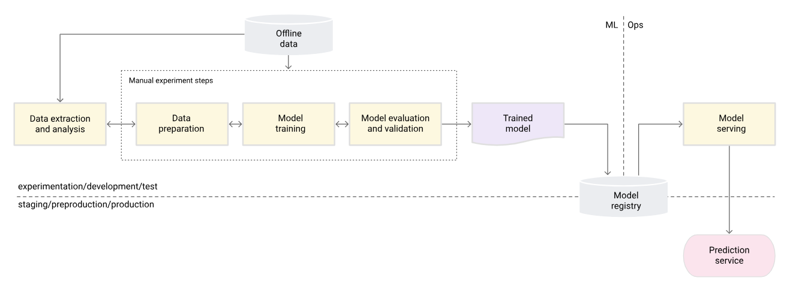

# ITU BDS MLOPS'25 - Project

Prior to working with this project, ensure these versions are installed:

    dvc 3.63.0
    Docker 28.5.2
    git 2.34.1
    dagger v0.19.6
    go 1.25.5

Other versions may work, but these are known to work.

## THE PROJECT
The overall purpose of the Model Artifact is to identify users on the website that are new possible customers. This is done by collecting behaviour data from the users as input, and the target is whether they converted/turned into customers -- essentially a classification problem.

The diagram below provides an overview of the structure that this project follows.

The cookiecutter files contain 5 py files which make up the majority of the code from the original jupyter notebook. They are split in adherance to standard data science MLOPS project structure workflow as seen in the diagram below:

The following illustrates some of the key parts of the repository structure for this project:

    ├── README.md          <- The README for this project

    ├── .github/workflows  <- This contains the Github automation workflow

    ├── data
    │   ├── interim        <- This is where the final model gets stored
    │   └── raw            <- Contains a file for the dvc pull of the raw data from it's source,
    │                          this promotes version control
    │
    ├── docs               <- A folder containing the images used in this README.md
    │
    ├── notebooks          <- Jupyter notebooks containing all the original code for this project, 
    │    │                     which is an excerpt and re-written example from a real production model
    │    │             
    │    └── main.ipynb    <- This contains the project task outline,
    │                           as well as the data processing part of the ML pipeline
    │
    ├── requirements.txt   <- The requirements file for reproducing the analysis environment

    ├── pipeline.go        <- This contains the dagger pipeline that organises the code workflow 
    │
    └── src   <- Source code for use in this project
        │
        ├── config.py               <- Store useful variables and configuration
        │
        ├── dataset.py              <- Data extraction and cleaning
        │
        ├── features.py             <- Data preparation for modeling
        │
        ├── model_selection.py      <- Code to run model comparison and serving       
        │             
        └── train.py                <- Model training

# Run this project 
In order to run this project, clone this repository, then type the following into your terminal from the root directory:

    go run pipeline.go

Subsequently, the most important output, the trained model file named 'lr_model.pkl', can be found in the data/interim folder.